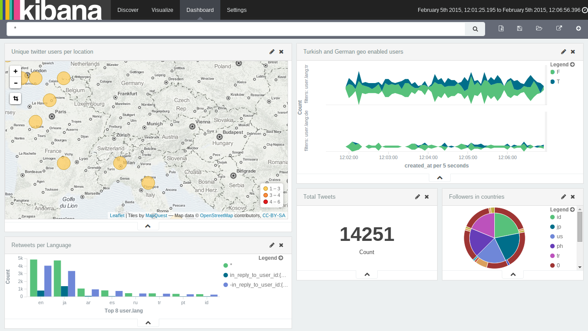
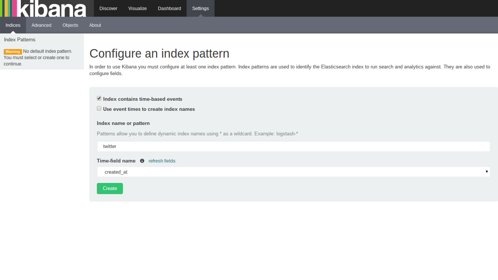

*This tutorial is up to date with Kibana 4.0.1.*

Kibana 4 is the new version of Kibana, a web frontend to analyze data held in an
elasticsearch cluster, with lots of changes compared to the prior Kibana 3 version.
This is a series of tutorials on how to analyze your data with Kibana 4. It aims at
all Kibana 3 users, who want to upgrade and at all people who never worked with
Kibana before and want to get known how they can use it.

This tutorial will **not** cover usage of the search engine elasticsearch (without Kibana)
or details on how to set up the required software. This is a pure usage tutorial.

At the end of the tutorials series, your Kibana 4 Dashboard might look like that:

Set up a test environment
-------------------------

If you have an elasticsearch running and want to use it, you can just download the
latest [Kibana 4](https://www.elastic.co/downloads/kibana) and install it. If you don’t
have an elasticsearch running or don’t want to use it, we provide a
[Kibana 4 Vagrant VM](https://github.com/timroes/kibana4-vagrant) (Attention: this VM contains a pretty old Kibana version).
You can download this and start up your own Kibana 4 instance with sample data, without much effort. See the linked
GitHub page for usage and setup instructions. If you have problems with the Kibana 4
vagrant machine, please file an issue on GitHub for this.

Sample data
-----------

If you use the provided Kibana 4 vagrant machine, you will have the same sample data,
we use throughout the tutorials. There are two indices (sets of data) included:

**twitter**: contains a set (~15.000) of public tweets, all collected on February,
5th 2015, between 12:00 and 12:05 (UTC+1) approximately. This is event based data
and will be used during this tutorials. Notice on the data: It has been recorded
from the live stream, meaning each message has been recorded the moment it appeared
(was tweeted). That’s why no message will have any count of retweets or favorites.

**bank**: contains a list of sample account data (taken from the
[elasticsearch docs](https://www.elastic.co/guide/en/kibana/current/tutorial-load-dataset.html)).
This data is not event based, meaning one document/entry does not hold a timestamp
when it "happened". We won’t use this set during this tutorial, but you can use it
to play around with and also test some non event based data.

Setting your index(es)
----------------------

If you start up Kibana for the first time you will be asked to configure an index
pattern. The first important step is to select whether you want to handle time-based
events like our *twitter* example or any other data set that contains a timestamp in
each document or if you want to work with "static" data like the bank sample data.

In elasticsearch it is common to store time-based events in multiple indexes to
facilitate search and allow for memory optimization. With one index per day, you
could then have a naming pattern for the indexes like *twitter-2015.01.15*,
*twitter-2015.01.26*, and so on. If you store your data like that (which is not the
case for the sample data) you should mark the "Use event times to create index names"
checkbox. In that case you can specify the index pattern as follows:
*[twitter-]YYYY.MM.DD*. Also, you will have to select if you use hourly, daily, weekly,
monthly or yearly indexes.

For this tutorial we want to set up the twitter index, which contains time-based events,
but does not use index splitting. So we mark the first checkbox, but not the second
one, and enter the index name *twitter* in the *Index name or pattern* box. When Kibana
detects an index with that name, a selectbox will appear, in which we have to specify
the timestamp field that contains the time of the event. In the case of the twitter
index the field is named *created_at* and your screen should look like the following
screenshot before hitting *Create*.

After creating the index pattern, the index screen will show you a list of all
fields that exist in the document with further information about their type,
whether they are indexed and whether their contents have been analysed.

Pages in Kibana
---------------

At the top of the page, Kibana shows the main navigation, which will give you access
to the 4 main pages in Kibana: Discover, Visualize, Dashboard and Settings. Below,
we give a short overview of the purposes of those sections. They are described in
more detail in the corresponding tutorial parts. We recommend to read these in-depth
parts in the order they are linked here, since they build on each other:

### Discover

The discover page displays all documents from a selected timespan (if the index
contains time-based events) in a table. This roughly corresponds to the tabular
view (usually) at the bottom of Kibana 3 dashboards. If you index doesn’t contain
time based data, it will just list all data.

Read more in the [Discover](/kibana-4-tutorial-part-2-discover) tutorial.

### Visualize

In Kibana 4 a visualization is a graph, map, table or other visualization of a
special aspect of your data. On this tab you will create or modify your visualizations.
It’s where most of the "producer" action happens in Kibana.

Read more in the [Visualize](/kibana-4-tutorial-part-3-visualize) tutorial.

### Dashboard

Several visualizations can be placed on one dashboard. The dashboard corresponds
to its Kibana 3 counterpart, with the difference that visualizations are not linked
to a special dashboard anymore, and that a dashboard is not restricted to one index
but can contain visualizations of any indexes you wish. This is mostly what
"consumers" of Kibana will use, to look at all the beautiful visualizations you created.

Read more in the [Dashboard](/kibana-4-tutorial-part-4-dashboard) tutorial.

### Settings

The settings page does pretty much what the name promises. You can change your settings
there, like adding indexes to or removing them from your Kibana instance. There isn’t
a tutorial part for this section, but it might be visited in some of the other tutorials.

What’s next?
------------

You just added the twitter index to your Kibana instance, so head on to the
[Discover tutorial](/kibana-4-tutorial-part-2-discover) to start using your data.
