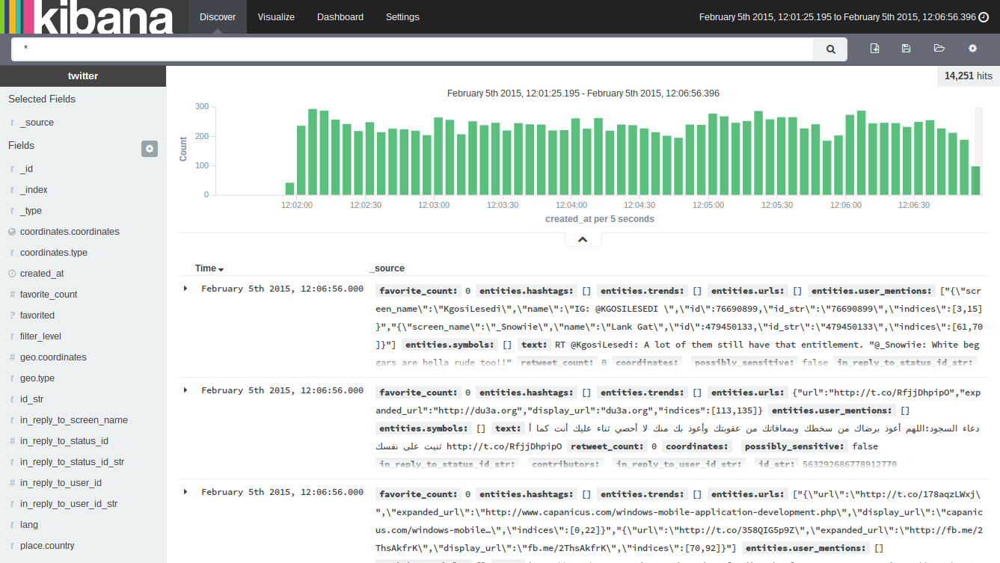
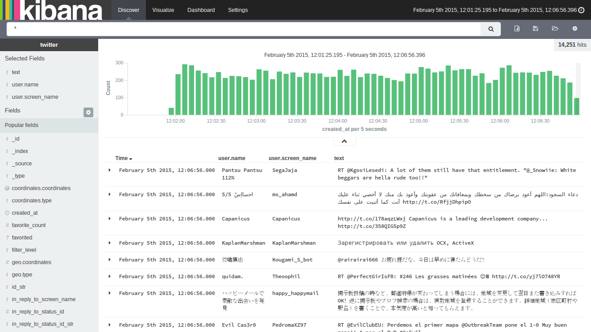
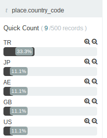
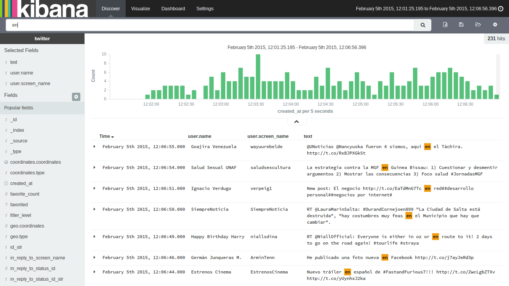

This part of the Kibana 4 tutorial series covers the usage of the discover page.
We assume you have completed all the steps in [Part 1 – Introduction](/kibana-4-tutorial-part-1-introduction).

The Discover view presents all the data in your index as a table of documents (not seeing anything when using the Kibana 4 vagrant machine, just continue reading).

Change the index
----------------

To change the index you want to see the data from, you can press the gear icon on
the right side of the window. If you use the sample data, there will only be the
twitter index, so you cannot change anything there.

Select the time
---------------

For all time-based data (like our twitter data), you can select the time span, that
you want to analyze in the current view at the top right of the window. There are
multiple ways to get to the documents you are interested in: Either use the *Quick*
tab to quickly select a date range like **today** or **Last 1 hour** or use the relative and
absolute tabs to specify which time spans you want to look at.

**Attention**: If you use the sample data, you most likely won’t see anything by default.
This is because the sample data was collected at a specific time in the past
(February 5th ~12:00, 2015 - yeah it's an old tutorial!). You have to select a time range where this date is included.

After you selected a time range which contains data, you will see a histogram at the
top of the screen, which will show the distribution of events (tweets) over time.
You can select a range in there if you want to "zoom into" a specific time span.
You can "zoom out" again by just pressing back in your browser (yeah, Kibana 3 users,
this finally works).

The time you select will apply to any screen you visit (dashboards, visualize, etc.)
and all of these screen offer you the possibility to change the time at the top right
of the page.

You also have the possibility to set a refresh rate there. This will allow you to
automatically refresh a dashboard e.g. every minute. This might be useful, if you
use Kibana to monitor some of the underlying data.

Fields
------

On the left side of the page you have a list of the fields (with their data type indicated
by an icon), that exist in the documents. If you hover over a field, you have the
possibility to click *add* which will add a column containing the contents of this
field to the table. As soon as you added your first field, the output of whole
documents in the list will vanish. No matter what fields you have added as columns,
you can always expand a row on the caret in the front. You can also remove fields,
that you don’t want to see as columns anymore in the section *Selected Fields* above
the field list on the left.

The following screenshot shows the discover page with only the user’s name, the
user's screen name and the text they tweeted shown in the table:

If your data has a lot of fields, you can also use the small gear icon below the *Fields*
title on the left side, to filter the fields for some information (like whether they
are analyzed, indexed, their type or just search for a name).

Saving and Loading
------------------

If you want to store your field list (and the queries, that we will write in a moment),
you can press the *Save Search* icon beside the search box at the top. You have to specify a name.

You can press the *Load Saved Search* icon at any time and you will get a list of all saved
searches. If you have a lot of saved searches the filter box might be useful, which
lets you search in all names.

To start over a complete new view, press the *New Search* button. Never forget to
save your views with the already mentioned save button, otherwise they won’t be
persisted. It is easy to forget that, since you can surf around between the different
tabs (dashboard, discover, etc.) and on return Kibana will automatically show the
last table with the fields you have selected.

**The save/load/new buttons are also available for Dashboards and Visualizations
with the same functions and the same warning!**

Filter for documents
--------------------

You can expand any field in the fields list on the left by clicking on it. It will
reveal the list of the most common values for that field. Use the – and + magnifier
icons to quickly add a filter for to show only documents having that value (+) or
to exclude all documents with that value (-).

If you add filters that way, a bar will appear on the top below the search bar.
Each filter will be displayed as a tag, that you can disable temporary or remove completely.

Filters can also be set by expanding the table rows on the right which show the
document contents and using the filter buttons which are shown there. Note that
documents may contain fields which are not indexed and can thus not be used for
filtering. You won’t find any filter buttons for those.

Search for documents
--------------------

To search and filter the documents shown in the list, you can use the large Search
box at the top of the page. The search box accepts query strings in a special syntax.

If you want to search content in any field, just type in the content, that you want
to search. Entering *traffic* in the search box and pressing enter will show you only
tweets that contain the term *traffic*. For another example, add the field lang as a column.
If you now enter the term *en* in the search box you several English tweets, where the
lang field has the value en but also a lot of Spanish tweets containing this word in
the text. If you enter a search term like this, Kibana will search all fields and not
only those which are currently shown as columns.

The query language allows also some more fine-grained search queries, like:

| Search Term                 | Description                                                              |
|-----------------------------|--------------------------------------------------------------------------|
| lang:en                     | to just search inside a field named “lang”                               |
| lang:e?	                    | wildcard expressions                                                     |
| lang:(en OR es)             | OR queries on fields                                                     |
| user.listed_count:[0 TO 10] | range search on numeric fields                                           |
| lang:/e[ns]/                | regular expression search (very slow, only do this if really necessary!) |

Searching in your data can feel confusing in the beginning, since it is highly influence
by the way you index your data. You can find a detailed explanation in my tutorial
about [Elasticsearch/Kibana queries](/elasticsearch-kibana-queries-in-depth-tutorial) or in the official
[elasticsearch documentation](http://www.elasticsearch.org/guide/en/elasticsearch/reference/current/query-dsl-query-string-query.html#query-string-syntax).

Like the selected fields, the entered query will be persisted, if you save your search.

What’s next?
------------

You are now able to view your data in a tabular way and search and filter it. This
is useful, if you want to look up specific documents and their content. The real
power of Kibana will be shown in the next part ([Visualize tutorial](/kibana-4-tutorial-part-3-visualize)), where we show
how to build visualizations for that data.
