This is part 3 of the Kibana 4 tutorial series. We assume you have completed at
least the steps in [Part 1 – Introduction](/kibana-4-tutorial-part-1-introduction).

Visualizations are the heart of Kibana 4. They are used to aggregate and visualize
your data in different ways. To understand visualizations, we have to look at
elasticsearch aggregations first, since they are the basis. If you are familiar
with elasticsearchs aggregations, you can skip the next paragraphs.

Aggregations
------------

The aggregation of our data is not done by Kibana, but by the underlying elasticsearch.
We can distinguish two types of aggregations: bucket and metric aggregations. To get
a good grip on visualizations with Kibana 4, it is essential to understand how those
aggregations work, so don’t be discouraged by the wall of text coming up.

### Bucket aggregations

A bucket aggregation groups all documents into several buckets, each containing a
subset of the indexed documents. The decision which bucket to sort a specific document
into can be based on the value of a specific field, a custom filter or other parameters.
Currently, Kibana 4 supports 7 bucket aggregations, which will be described in the
following paragraphs. For each aggregation an example for the sample twitter data is
given. Later in this tutorial we will see some complete examples for several of them:

#### Date Histogram

The date histogram aggregation requires a field of type date and an interval. It
will then put all the documents into one bucket, whose value of the specified date
field lies within the same interval.

*Example*: You can construct a Date Histogram on the created_at field of all messages
with the interval minute. In this case, there will be a bucket for each minute and
each bucket will hold all messages that have been written in that minute.

Besides common interval values like minutes, hourly, daily, etc. there is the special
value *auto*. When you select this interval, the actual time interval will be determined
by Kibana depending on how large you want to draw this graph, so that a good amount
of buckets will be created (no t too many to pollute the graph, nor too few so the
graph would become irrelevant).

#### Histogram

A histogram is pretty much like a date histogram, except that you can use it on every
number field. Same as with date histogram, you specify a number field and an interval
(which in this case is any number). The aggregation then builds a bucket for each interval
and puts in all documents, whose value falls inside this interval.

*Example*: An histogram on the field *user.utc_offset* (which holds the timezone offset
from the UTC in seconds) with an interval of 3600, will create a bucket for each full
timezone (UTC+1 hour, UTC+2 hours, and so on) and will put all the documents in there,
whose user had the appropriate UTC offset. If you select a value of 1800 it will
create a bucket for each 30 minutes timezone.

#### Range

The range aggregation is like a manual histogram aggregation. You also need to specify
a field of type number, but you have to specify each interval manually. This is useful
if you either want differently sized intervals or intervals that overlap.

*Example*: You could create a range aggregation on the field *user.followers_count* with
the ranges 0-100, 100-1000 and 1000-*. That way you would get three buckets, containing
the documents of users that have either 0-100, 100-1000 or 1000 followers and above.
This could be useful to e.g. cluster twitter users by "success".

Whenever you enter a range in Kibana, you can leave the upper or lower bound empty
to create an open range (like the above 1000-*).

#### Terms

A terms aggregation creates buckets by the values of a field. This is much like a
classical *SQL GROUP BY*. You specify a field (which can be of any type) and it will
create a bucket for each of the values that exist in that field, and put all
documents in that field that have the value.

*Example*: You can run a terms aggregation on the field *user.country_code* which holds
the two letter country code of the user. After that you will have a bucket for each
country code (jp, us, tr, ru, etc.) and in each bucket the documents of all users
from that country.

The aggregation doesn’t always need to match the whole field value. If you let elasticsearch
analyze a string field, it will by default split its value up by spaces, punctuation
marks and the like, and each part will be an own term, and as such would get an own
bucket. If you do a term aggregation on the text field (which contains the actual tweet),
you might assume that you would get nearly one bucket per tweet, because two messages rarely
are exactly the same. But this field is analyzed in our sample data, so you would get
buckets for e.g. *t.co*, *http*, *rt*, and so on and in each of these buckets all documents,
that had that term in the text field (even though it doesn’t need to match the text field exactly).

Elasticsearch can be configured not to analyze fields or you can configure the analyzer that is
used to match the behavior of a terms aggregation to your actual needs. E.g. you could let the
text field be analysed so that colons (:) and slashes (/) won’t be split separators.
That way, an URL would be a single term and not split up into http, the domain, the
ending and so on. More information on analyzers can be found in the
[elasticsearch documentation](http://www.elasticsearch.org/guide/en/elasticsearch/reference/current/analysis-analyzers.html).

#### Filters

A filter aggregation is a completely flexible (but therefore maybe slower than the others)
aggregation. You just specify a filter for each bucket and all documents, that match the
filter will be in that bucket. Each filter is just a query as described in [Part 2](/kibana-4-tutorial-part-2-discover)
of the tutorials in section **Search for documents**. The filter you specify for each bucket can be
whatever you like, meaning there doesn’t need to be any relation between these filters
(though most likely for a useful graph there *is* a connection between them).

*Example*: Create a filter aggregation with one query being "place.country_code:(tr or jp)"
and the second filter being “user.follower_count:[1000 TO *]”. That way the aggregation
creates two buckets, one containing all the tweets from turkey and japan, and one bucket
with all the tweets of users with 1000 or more followers. It is up to you, to decide what
kind of analysis you would do with these two buckets.. as already mentioned, completely
unrelated queries in the filters aggregation rarely make sense. :-)

#### Significant Terms

The significant terms aggregation can be used to find "uncommonly common" terms in a
set of documents (cf. [Elasticsearch Guide](http://www.elasticsearch.org/guide/en/elasticsearch/guide/current/significant-terms.html)).
Given a subset of documents, this aggregation finds all the terms which appear in this
subset more often than could be expected from term occurrences in the whole document set.
It then builds a bucket for each of the significant terms which contains all documents
of the subset in which this term appears. The size parameter controls how many buckets
are constructed, i. e. how many significant terms are calculated.

The subset on which to operate the significant terms aggregation can be constructed
by a filter or you can use another bucket aggregation first on all documents and
then choose significant terms as a sub-aggregation which is computed for the documents in each bucket.

*Example*: We use the search field at the top to filter our documents for those with
user.lang:en and then select significant terms as a bucket aggregation. The top 3
significant terms for this subset of documents are "to", "the" and "you".

Those terms are indeed more representative of *English* tweets than those we get when
building a top three terms aggregation on the same subset of documents: "to.co",
"http" and "rt". Although these terms appear in a lot of English tweets they are
as often found in tweets with other user languages.

It could be interesting to filter our tweets by user language and then subdivide them
further, for example by time zone or user name to see which terms are representative
for a subgroup of all users with *user.lang:en*. For our purpose of getting to know Kibana
and playing around with the visualizations the corresponding results would be adequate.
Note however, that in order to deliver relevant results that really give insight into
trends and anomalies in your data, the significant terms aggregation needs sufficiently
sized subsets of documents to work on. And a further side note: That our significant
terms don’t tell us much about the contents of the tweets has to do with the fact that
we are looking for terms that are significant for English documents compared to documents
in other languages. For this reason, we get terms which are very common in English texts,
so-called stop words. In an all-English set of documents, if we built a subset and examined
it for significant terms, those stop words would usually not even come near to being
significant because they would appear in almost every document and thus would not be
"uncommonly common" for any subset of the whole document collection.

#### Geohash

Elasticsearch can store coordinates in a special type geo_point field. That way the
geohash aggregation can create buckets for values close to each other. You have to
specify a field of type *geo_point* and a precision. The smaller the precision, the
larger area the buckets will cover.

*Example*: You can create a geohash aggregation on the *coordinates.coordinates*
field in the twitter data. This will create a bucket each containing tweets close
to each other (how close [and therefor how many buckets you need for all data] will
be specified by the precision.

*Hint*: This kind of aggregation makes mostly sense, if you use a *Tile Map* visualization
(will be covered later). In all other aggregations you will just see a cryptic geohash string,
which doesn’t make much sense, if not shown on a map.

### Metric Aggregations

After you have run a bucket aggregation on your data, you will have several buckets
with documents in them. You now specify one metric aggregation to calculate a single
value for each bucket. The metric aggregation will be run on every bucket and result
in one value per bucket.

In the visualizations the bucket aggregation usually will be used to determine the
"first dimension" of the chart (e.g. for a pie chart, each bucket is one pie slice;
for a bar chart each bucket will get it’s own bar). The value calculated by the metric
aggregation will then be displayed as the "second dimension" (e.g. for a pie chart,
the percentage it has in the whole pie; for a bar chart the actual high of the bar on the y-axis).

Since metric aggregations mostly makes sense, when they run on buckets, the examples
of metric aggregations will always contain a bucket aggregation as a sample too.
But of course you could also use the metric aggregation on any other bucket
aggregation.. a bucket stays a bucket.

#### Count

This is not really an aggregation. It just returns the number of documents that are
in each bucket as a value for that bucket. Sounds pretty simple, but is often enough
for many kinds of analysis.

*Example*: If you want to know, how many tweets are from which country, you can use
a term aggregation on the field *place.country_code* (which will create one bucket
per country code) and afterwards run a *count* metric aggregation. Every country
bucket will have the number of tweets as a result.

#### Average/Sum

For the average and sum aggregations you need to specify a numeric field. The result
for each bucket will be the sum of all values in that field or the average of all
values in that field respectively.

*Example*: You can have the same country buckets as above again and use a average
aggregation on the *user.followers_count* field to get a result of how many followers
does a twitter user in that country have in average.

#### Max/Min

Like the average and sum aggregation, this aggregation needs a numeric field to run on.
It will return the minimum value or maximum value that can be found in any document
in the bucket for that field.

*Example*: If we use the country buckets again and run a maximum aggregation on the
*retweet_count* we would get for each country the highest amount of retweets a tweet
had in the selected time period. (Notice: this won’t work in the sample data, since
they are recorded from public stream, meaning they were put into elasticsearch
straight when they have been written, where they obviously hadn’t had any retweets
at that time.)

#### Unique count

The unique count will require a field and count how many different / unique values
exist in documents for that bucket.

*Example*: This time we will use range buckets on the *user.follower_count* field,
meaning we will have buckets for e.g. users with 1-100, 100-1000 and 1000-* followers.
If we now run a unique count aggregation on the *place.country_code* field, we will
get for each followers range the number of how many different countries users with
so many followers would come. In the sample data that would show us, that there
are users from 18 different countries with 1 to 100 followers, from 30 for 100 to
1000 followers and from 4 different countries for 1000 followers and above.

#### Percentiles

A *percentiles* aggregation is a bit different, since it won’t result in one value
for each bucket, but in multiple values per bucket. These can be shown as e.g.
different colored lines in a line graph.

When specifying a percentile aggregation you have to specify a number value field
and multiple percentage values. The result of the aggregation will be the value
for which the specified percentage of documents will be inside (lower) as this
value. Confused? Let’s do this as an example:

You specify a percentiles aggregation on the field *user.followers_count* and specify
the percentile values 1, 50 and 99. This will result in three aggregated values
for each bucket. Let’s assume we have just one bucket with tweets in it (doesn’t
matter where this bucket came from). The 1 percentile result (and e.g. the line
in a line graph) will have the value 7. This means that 1% of all the tweets in
this bucket have a followers count with 7 or below. The 50 percentile result is
276, meaning that 50% of all the tweets in this bucket have a followers count of
276 or below. The 99 percentile have a value of 17000, meaning that 99% of the
tweets in the bucket have a followers count of 17000 or below.

If you want to read more on percentile aggregations, you can read the
[elasticsearch documentation](http://www.elasticsearch.org/guide/en/elasticsearch/reference/current/search-aggregations-metrics-percentile-aggregation.html).

Visualizations
--------------

Now that you’ve got an idea about what the available aggregations do, we will look
at how to use them with visualizations. The different visualizations and what they
do in short:

| Chart Type         | Description |
|--------------------|-------------|
| Area Chart         | Displays a line chart with filled areas below the lines. The areas can be displayed stacked, overlapped, or some other variations. |
| Data Table         | Displays a table of aggregated data. |
| Line Chart         | Displays aggregated data as lines. |
| Markdown Widget    |	A simple widget, that can display some markdown text. Can be used to add help boxes or links to dashboards. |
| Metric             | Displays one the result of a metric aggregation without buckets as a single large number. |
| Pie Chart          | Displays data as a pie with different slices for each bucket or as a donut (depending on your taste). |
| Tile Map           | Displays a map for results of a geohash aggregation. |
| Vertical bar chart | A chart with vertical bars for each bucket. |

### Saving and Loading

While editing a visualization you will see the same New, Save and Load icons beside
the search bar, as known from the Discover screen. The same rules apply there: When
switching to another tab (e.g. *Dashboard*) and back again to the Visualize tab, Kibana
will return to the very same visualization that you just edited. **But** unless you save
this visualization it is not really persisted! So if you don’t want your visualization
to be lost, always save it! This is easy to forget, especially once you saved it and
edit it afterwards. These edits will be stored temporary when you switch tab, but
they are not persisted at all in Kibana, unless you press save again.

### Starting your first visualization

When you go to the Visualize tab, you will see a list of visualizations you can
create and below a list of all saved visualizations, that you can open for editing.

Once you clicked a visualization type to create you have two options:

* From a new search
* From a saved search

You can use *From a saved search* to link a visualization to a query that you have
save on the Discover page. If you don’t want to link it, just click From a new
search to visualize on all of your data.

*Sidenote*: If you have added multiple indexes to your Kibana, you will be asked
for which of the indexes you want to generate a visualization at this point.
Unless you use *From a new search* in which case the visualization will be linked
to the same index than the search.

In the following all the visualizations are described in detail with some example.
The order is not alphabetically, but an order order that should be more intuitive
to understand the visualizations.

A lot of the logic that applies to all charts will be explained in the *Pie Charts*
section, so you should read this one before the others.

### Pie chart

Once you selected the Pie Chart you will come to the visualization editor. This
screen has a preview of your visualization on the right, and the edit options in
the sidebar on the left.

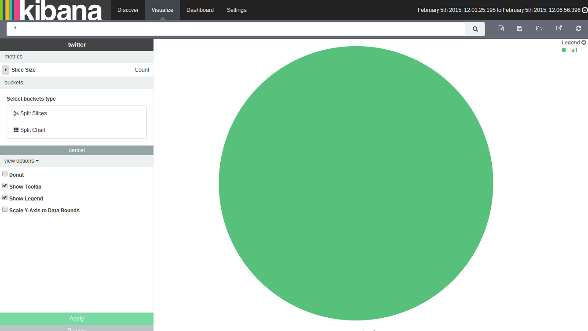

The sidebar on the have always the two buttons on the bottom: *Apply* and *Discard*.
In more recent Kibana versions these are now two icon buttons on top right of the panel.
*Apply* is no a play icon and *discard* a cancel cross beside it.
If you make changes in the editor, you have to press *Apply* to see them in the preview
on the right side, or press Discard to throw them away and reset the editor to the
state, that is currently shown in the preview (i.e. the last state you applied).

#### View options

Every visualization has the expandable view options  where you can change some options
about the visualization. For the pie chart there exist three different options:

**Donut** checks wjether or not the diagram should be displayed as a donut instead of a pie.

**Show Tooltip** exist on most of the visualizations and allow to enable or disable tooltips
on the diagram. When they are enabled and the user hover over a slice of the pie chart
(or bar in a bar diagram, etc.), a tooltip will appear showing some data about that slice,
e.g. which field and value this belongs to and the value that the metrics aggregation calculated.

**Show Legend** will enable and disable the legend of the diagram. A legend appears as
soon as there is more then one slice, bar, or similiar, and show what color belongs to which bucket.

#### Aggregations

Above the view options visualizations have the list of their bucket aggregations applied
(as long as the visualization supports bucket aggregations). You can add a new bucket
aggregation by pressing *Add Aggregation* in the *buckets* section.

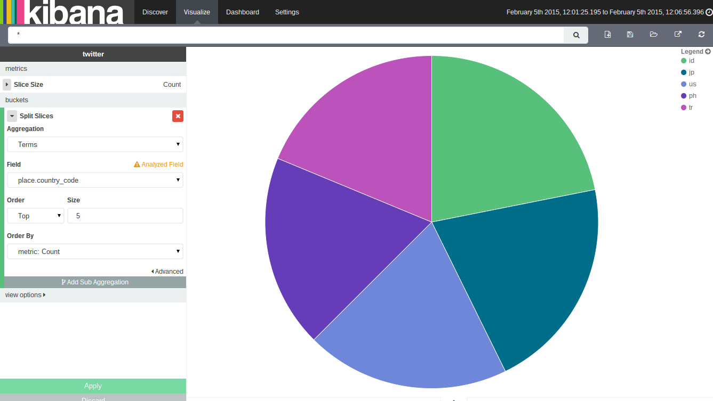

Kibana asks you now to specify in which way the different buckets of these aggregations
should be shown. A common option, that exists for most of the visualizations is the
*Split Chart* option. That way each bucket that will be created by the bucket aggregation
gets an own chart. All the charts will be placed beside and below each other and make
up the whole visualization.

The other option for pie charts is *Split Slices*, which will generate a slice for each
bucket. Let’s add a *Split Slices* type. Kibana now asks you for the aggregation and its
parameters. Let’s say we want to see how the tweets distributed across countries. We
will select a *terms* aggregation, select the field *place.country_code* and hit Apply.

The result should look like the screenshot on the right side. We got one pie slice
per bucket (i.e. per country code). But how is the size of the slice in the pie
determined? This will be done by the metric aggregation, which by default is set
to *Count of documents*. So the pie now shows one slice per country bucket and its
percentage depends on the amount of tweets, that came from this country.

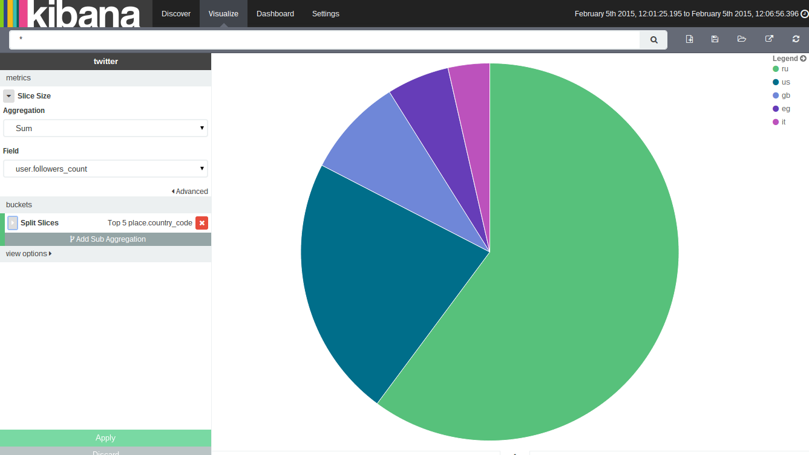

But, why are there only shown five slices? This is determined by the *Order* and *Size*
option in the bucket aggregation. You can specify how many buckets you want to see in the
diagram, and if you would like to see the ones with the least (bottom) or the highest (top)
values. What might be a bit confusing is, that these order and size actually is linked
to the metric aggregation on the top. To demonstrate this, we will switch the metric
aggregation on the top. When you expand it you can switch the type to *Sum* and the
field to *user.followers_count*. You will now get a slice for each country and its size
will be determined, by the sum of the followers, that posted a tweet in our time range.

If you now select *Top 5* not the same 4 countries will be shown anymore. Top 5 means,
that it will now show the 5 countries, where this sum of followers is the highest.
Beforehand it has shown the 5 countries, where the count of documents was the highest.
So the order settings depends on the metric aggregation, that you have selected at
the top of the editor. With the *Order by* select box you can also specify another
metrics aggregation, that you want to use for ordering. Some graph types support
multiple metric aggregations. If you add multiple metrics aggregations you will
also be able to select in the *order by* box, which of these you want to use for ordering.

Let’s undo the changes again, so we use the document count, and the diagram looks
again like the previous screenshot.

A lot of diagram can used nested bucketing, so does the pie chart. You can click
the *Add Sub Aggregation* button to add another level of bucketing. You can not
nest the different types how the chart should display this in any order you want.
For example the pie chart will complain, if you try to add now a *Split Chart* type,
because it would like to first split charts, then use the sub aggregation on each chart.

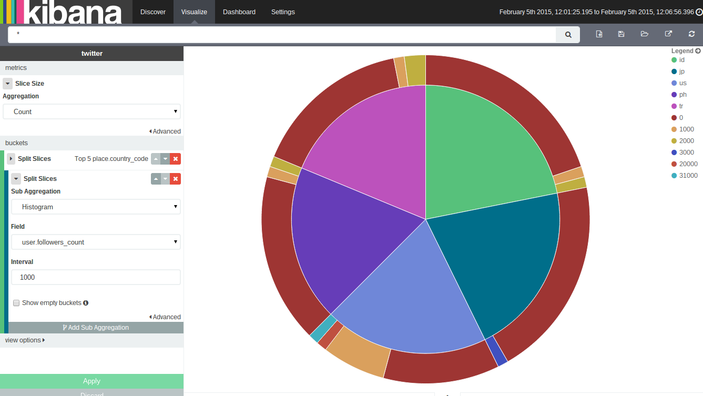

We will just add another *Split Slices* aggregation. Use a Histogram aggregation on
the field *user.followers_count* with an interval size of 1000. The result should
look like the screenshot on the right side. Adding a sub aggregation of type
*Split Slices* will cause a second ring of slices around the first ring.

What does happen here? Kibana first aggregate via a terms aggregation on the country
code field, so we have one bucket for each country code with all the tweets from
that country in it. These buckets are shown as the inner pie and their size is
determined by the selected metric aggregation (count of documents in each bucket).

**Inside** each bucket Kibana now use the nested aggregation to group by the followers
count in a thousand interval. The result will be a bucket for each country code and
inside each of these buckets, are buckets for each followers interval. The size of
the inside buckets are again determined by the selected metric aggregation, meaning
also the size of documents will be counted. In the pie chart you will see this nested
aggregation as more slices in the second ring.

If you want to change the bucketing order, meaning in this case, you first want to
bucket the tweets by their followers and then you want to have buckets inside these
follower buckets for each country, you can just use the arrows beside the aggregation
to move it to an outer or inner level.

There are some options to the Histogram aggregation. You can set if empty buckets
(buckets in which interval no documents lie) should be shown. This doesn’t make any
sense for pie charts, since they will just appear in the legend, but due to the nature
of the pie chart, their slice will be 0% large, so you cannot see it. You can also
set a limit for the minimum and maximum field value, that you want to use.

Before we look at the next type of visualization, we should save this one for later
usage. Press the Save button on the top right and give your visualization a name.
To create a new visualization just hit the new button beside the save button.

### Tile Map

A tile map is most likely the only useful way to display a geohash aggregation.
When you create a new one, you can again use the *Split Chart* to create one map
per bucket, and the other option is the *Geo coordinates* type. That way you have
to select a field that contains geo coordinates and a precision. The visualization
will show a circle on the map for each bucket. The circle (and bucket) size depends
on the precision you choose. The color of the circle will indicate the actual value
calculated by the metric aggregation.

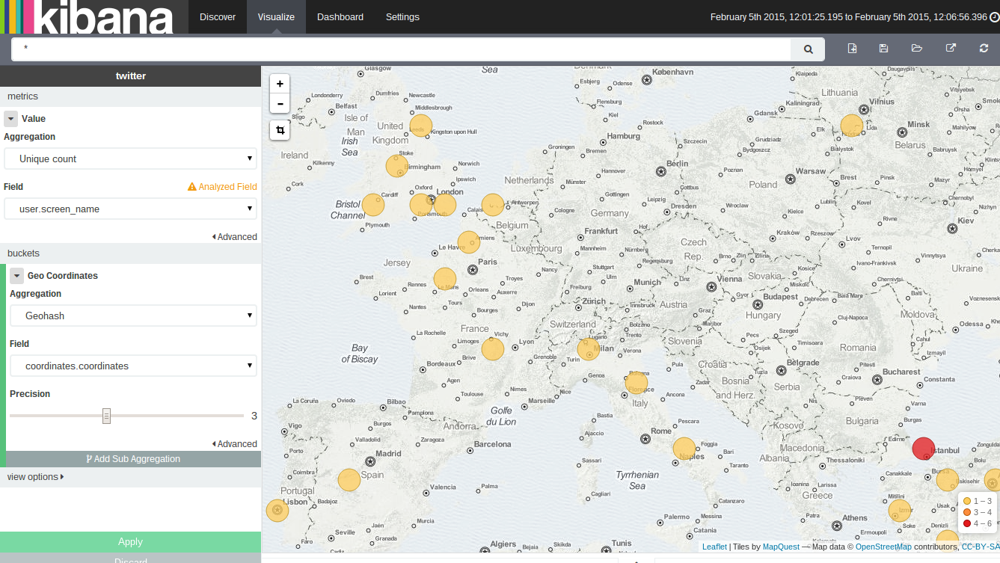

### Area/Line Chart

The Area Chart and Line Chart are very similar, except for the Area Chart painting
the area below the line, and so it supports different methods of overlapping and
stacking for the different areas. Both kind of charts are often used to display data over time.

The chart that we want to create, should compare German speaking vs. Turkish speaking
users in the way they have geo positions enabled. We want to split up the graph for the two languages.

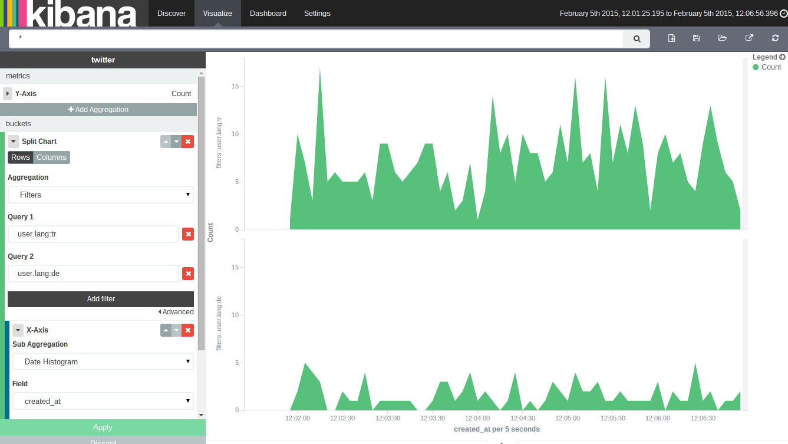

First we add a new bucket aggregation with type *Split Chart* with a filters aggregation
and one filter for user.lang:de and another for *user.lang:tr*. Then we add a sub
aggregation of type *X-Axis* of type *Date Histogram* on the field *created_at* with an
*auto* interval. As mentioned the x-axis will often be used to display a time value
(so data will be displayed over time), but it is not limited to that. You can use
any other aggregation if you like but take care, that the line (or area) will be
interpolated between two points on the x-axis. Which doesn’t make much sense, if
the values you choose aren’t anyhow consecutive.

After you have added those two visualizations the output should look like the screenshot on the right.

Add now another sub aggregation of type *Split Area* which will cause to create multiple
colored areas in the graph. To check whether geo positions are enabled, we will do a
terms aggregation on the field *user.geo_enabled*. Now you have a (or better two) graphs
showing the tweets which has geo positions enabled and the one who doesn’t for the
both languages German and Turkish.

In the *view options* you can change the *Chart Mode* which is currently set to stacked.
This option only applies to the area chart, since in a line chart there is no need
for stacking or overlapping areas. For area charts there exist five different types
of *Chart Mode*:

#### stacked

The area for each bucket will be stacked upon the area below. The total documents
across all buckets can be directly seen from the height, of all stacked elements.

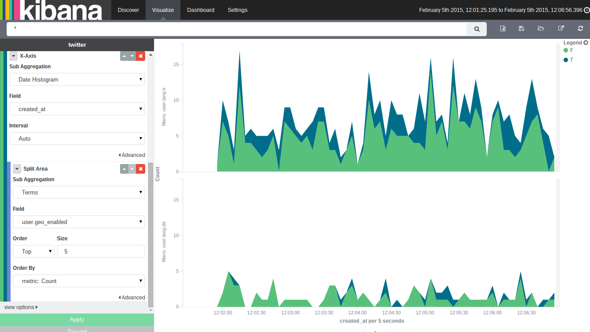

#### overlap

In the overlap view, areas won’t be stacked upon each other. Every area will begin
at the x-axis and will be displayed semi-transparent, so all areas overlap each other.
You can easily compare the values of the different buckets against each other that
way, but it is harder to get the total value of all buckets in that mode.

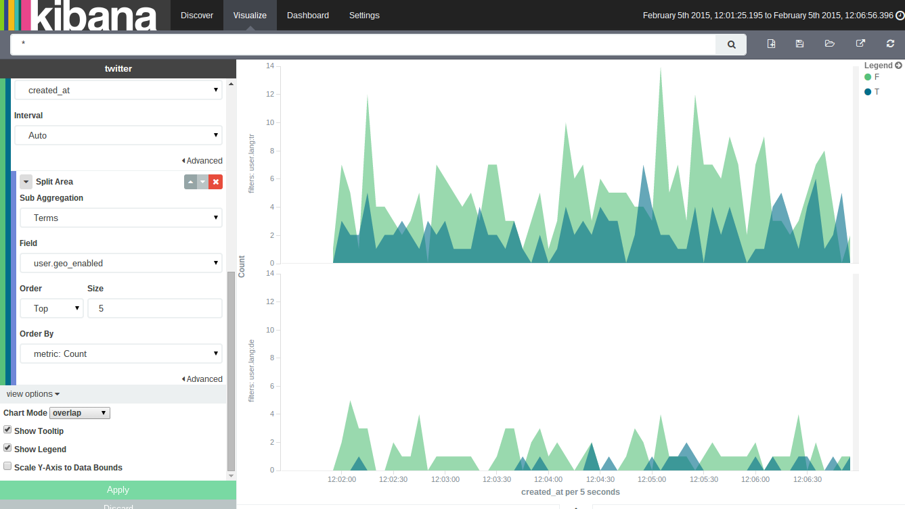

#### percentage

The height of  the chart will always be 100%  for the whole x-axis and only the
percentage between the different buckets will be shown.

#### silhouette

In this chart mode, a line somewhere in the middle of the diagram is chosen and
all charts evolve from that line to both directions.

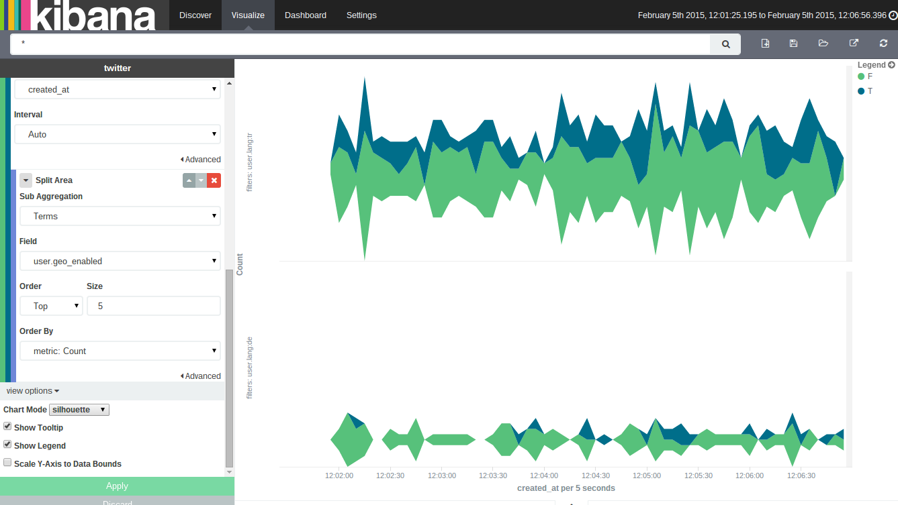

#### wiggle

This is much like the *silhouette* mode, but it doesn’t keep a static baseline from
which the areas evolve in both directions. Instead it try to calculate the baseline
for each value again, so that change in slope is minimized. If hardly ever found
that useful in a diagram, since it makes seeing relations between area sizes and
reading the total value more difficult than the other modes.

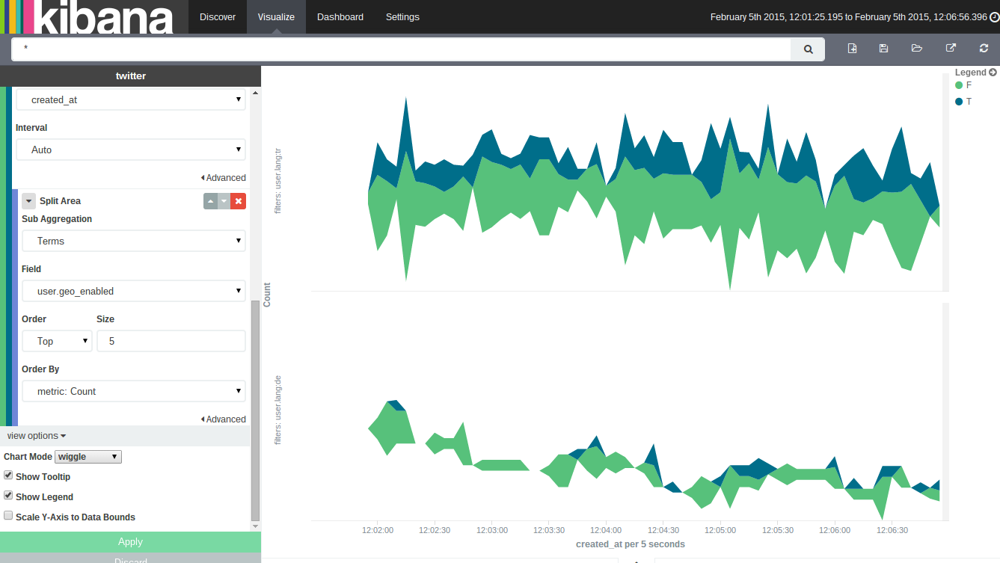

#### Multiple y-axises

Beside changing the view mode, you also have the possibility to add another metric
aggregation to either line or area charts. That metric aggregation will be shown
with its own color in the same diagrams. Unfortunately all metric aggregations you
add, will share the same scale on the y-axis. That’s why this makes most sense,
if your metric aggregations return values in the same dimension (e.g. one metric
that will result in values from up to 100 and another that result in values from
1 million to 10 million, won’t be displayed very well, since the first metric will
barely be visible in the graph).

### Vertical Bar

The vertical bar visualization is much like the *area visualization*, but more suited
if the data on your x-axis isn’t consecutive, because each x-axis value will get
it’s own bar(s) and there won’t be any interpolation done between the values of these bars.

You only have three bar modes available: *stacked*, which behave the same like in area chart,
it just stack the bard onto each other. *percentage* use 100% height bars, and only shows
the distribution between the different buckets. *Grouped* is the only different mode
compared to area charts. It will place the bars for each x-axis value beside each
other as shown in the screenshot on the right.

### Metric

A metric visualization can just display the result of a metrics aggregation.
There is no bucketing done. It will always apply to the whole data set, that
is currently taken into account (you can change the data set by typing queries
in the top box). The only view option, that exists is the font size of the displayed number.

### Markdown widget

This is a very simple widget, which doesn’t do anything with your data. You only
have the *view options* where you can specify some markdown. The markdown will be
rendered in the visualization. This can be very useful to add help texts or links
to other pages to your dashboards. The markdown you can enter is
[GitHub flavored markdown](https://help.github.com/articles/github-flavored-markdown/).

### Data table

A data table is a tabular output of aggregation results. It’s basically the raw data,
that in other visualizations would be rendered into some graphs. And as we will
cover in the paragraph *Debugging visualizations* you can actually get the table
of every visualization.

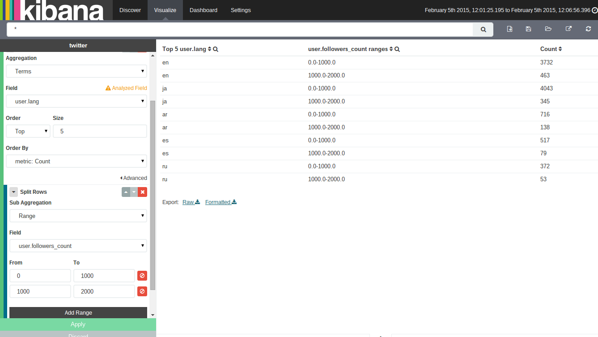

Let’s create a table that uses the *Split Rows* type to aggregate the top 5 *user.lang*
terms. and a sub aggregation with some ranges on the *user.followers_count* field.
In the screenshot on the right you can see what the aggregations should look like
and the result of the table.

We will get all the language buckets on the top level. They will be presented in
the first column of the table. Since each of these language buckets contains multiple
buckets for the followers nested aggregation, there are multiple rows with the
lang *en*, i.e. there is one row with *en* in the front for every bucket in the nested
aggregation. The first three rows are all for the *en* language, and each row for
one sub bucket of the nested aggregation. The result of the metrics aggregation
will be shown in the last column. If you add another nested aggregation you will
see, that those tables easily get pretty large and confusing.

If you would now like to see the result of the metrics aggregation for the terms
aggregation on the language, you would have to sum up all the values in the last column,
that belongs to rows beginning with en. This is some work to do, and wouldn’t work
very well for average metrics aggregations for example. In the *view options* you can
enable *Show metrics* for every bucket/level, which will show the result of the metrics
aggregation after every column, for that level of aggregation. If you switch it on,
after the en column should appear another column, which says something like 4874,
meaning there are 4874 documents in the en bucket. This will be shown in every row,
though it will always be the same for all rows with *en* in it. You can also set the
size of how many rows should be shown in one page of the table in the view options.

Queries in visualizations
-------------------------

After we learned about all the visualizations there are just some small features we
should talk about, before continuing to dashboards. Perhaps the most important one
is queries in visualizations.

As you remember from the [Discover tutorial](/kibana-4-tutorial-part-2-discover), you can enter queries
in a specific query language in the search box at the top of the page. This also
works for visualizations. You can just enter any query there, and it will use this
as a filter on the data, *before* the aggregation runs on the data. You can just try
this out on our data table we generated in the last paragraph, by e.g. entering
*user.lang:pt* to the search box and press enter. You will see that only rows with *pt*
as the language will be shown.

This filtering is very handy, because it will be stored with the visualization when
you save it, meaning if you place the visualization on a dashboard (see the next
part of the tutorial series) the query that you stored with the visualization will still apply.

Debugging Visualizations
------------------------

If you are more known to elasticsearch or interested in the raw data of your visualizations,
it might come handy to take a deeper look into them. Kibana offers you some debugging
output for your visualizations.

If you are in the Visualize screen, you can see a small up pointing arrow below the
visualization preview (you will also see this on dashboards below the visualizations).
Hitting this will reveal the debug panel with several tabs on the top.

#### Table

Will show the results of the aggregation as a data table visualization, i.e. it’s
the raw data the way Kibana sees it.

#### Request

The request tab shows the raw JSON of the request, that has been sent to elasticsearch
for this aggregation. This can get handy if you are common to elasticseach and its behavior.

#### Response

Shows the raw JSON response body, that elasticsearch returned for the request.

#### Statistics

Show some statistics about the call, like the duration of the request and the query,
the amount of documents, that where hit, and the index that was queried.

What’s next?
------------

After you have created lots of visualizations in this tutorial, it’s time to head
over to [part 4](/kibana-4-tutorial-part-4-dashboard), where you will see how to use dashboards in Kibana 4.
