[[info|Visual transcript]]
| This is a *visual transcript* of my
| [**Kibana 5 video introduction**](https://www.youtube.com/watch?v=mMhnGjp8oOI) on YouTube.
| It is the transcript of the video with small modifications in the wording and
| enriched with screenshots where needed. That's why the wording might occasionally sound
| strange for a blog post. I created this for accessibility reasons, people who prefer
| reading transcripts over watching videos and people without access to YouTube for some
| reason or another. If you are fine
| with videos, you should use the link above to watch the video on YouTube instead.

Welcome to this Kibana 5 introduction. Kibana is the frontend
inside the so called Elastic-Stack and I will guide
you through the first steps when visualizing your data with
Kibana 5.

This introduction will not cover how to setup Kibana or Elasticsearch.
It will neither cover how to insert data into Elasticsearch.
I assume you already have a running Kibana 5 instance and
data in your Elasticsearch.

Setting up your indexes
-----------------------

When you start Kibana 5 for the first time you will see the following
screen. Before we can start analyzing data we will need to tell Kibana
what's the name of our Elasticsearch index or indexes we want
to view.

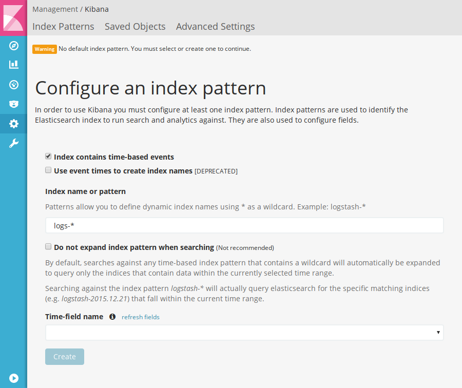

You need to enter your index name into this text field.
I will use some sample webserver log data during this
introduction. Those indexes are prefixed with logs in my case,
to I enter "logs-*" as the index patten name.

Kibana will now search for all indexes beginning with *logs*.
It's common to have time based data splitted up to multiple
indexes, for example one index per day or month - depending on what amount
of data you have. With this wildcard name patterns, Kibana will
find all those indexes.

If you don't have time based data, for example a database of
customers or similiar, you can uncheck the first option (**Index contains time-based events**) on this
page.

If you have time based data you now have to select the name
of the field that contains the primary time key. In our case that's the
`@timestamp` field containing the log time.

Once we've clicked on "Create" the index pattern is registered
in Kibana and we can use it. In this overview you will see
all the fields, their types and some additional information.

You can add further index patterns on the top left of the page by clicking on **Add New**.

Upcoming versions of Kibana will introduce a new CSV importer,
so that you can easily import your data via CSV into Elasticsearch
directly from Kibana.

Overview
--------

After we created the index pattern we can start working with our data.
You can access all the different views in the main menu on the left.

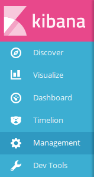

The **discover** view is used to view a list of documents and search for specific documents.

The **visualize** view is used to create visualizations like graphs from your data.

You can add those visualization to **dashboards** to have an overview of you data at a glance.

**Timelion** was formerly a plugin and is now build in. It's used to make advanced timeseries analysis.

The **management** tab are the settings of Kibana where you can add index patterns and tune some advanced settings.

The **Dev Tools** currently only contain the so called Console, which was formerly known as
the Sense plugin in Elasticsearch. You can use it to send JSON directly to Elasticsearch
and more meant for (as the name says) developers or advanced users. We won't cover
it in this introduction.

Discover
--------

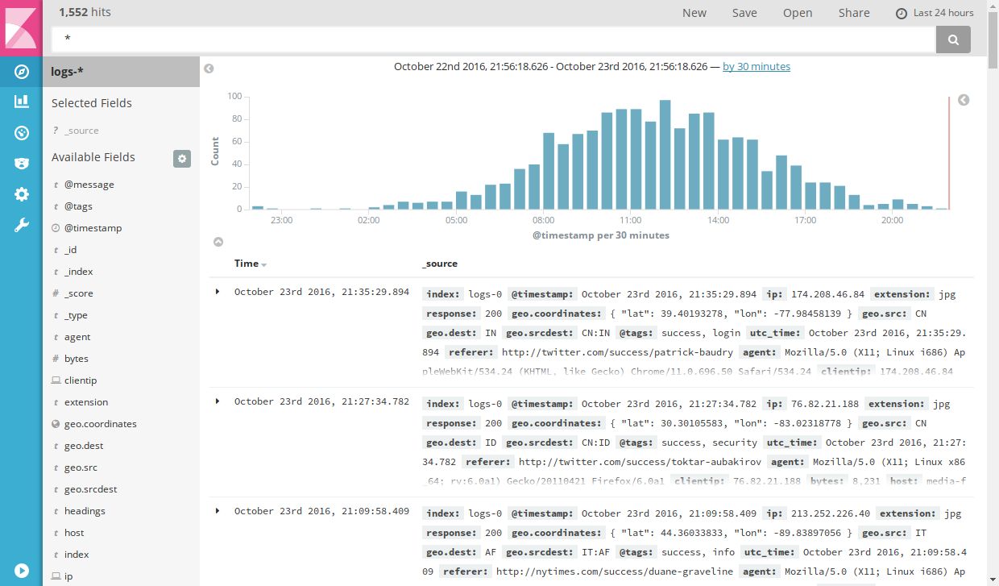

Let's look at the discover tab first. On the top you will
find the search bar to search for documents. You find options
to save, load and share searches above it.

On the left side you find a list of all fields, that exist in the
documents. In the main area of the page you find a distribution of
documents over the time and the actual list of documents in the index.

On top of the field list you can chose what index pattern you want to look at.
If we would have configured multiple index patterns we could click here to
see a list of all index patterns and select one.

For all time based indexes you can chose which time range you actually
want to view with the time picker on the top right. You can either set
the range chosing a quick option or specify it relative from now or as
absolute time date range.


I now want to see the last 24 hours of logs. To watch a document
we can expand it on the caret in front of it. Now you can see
all fields in this document, their types - indicated by a small icon in front -
and the actual value.


You also have several actions on each field, where you can filter for documents
with the same value (*magnifier with plus in it*), exclude documents with this
value from the list (*magnifier with minus*), add this field as a column
to the table (*the table icon*) - which we will cover in a moment - and a last
action to filter for documents, that actual have this field (*the star*), since
not all documents inside an index must look the same in Elasticsearch.

If you are only interested in some of the fields of each document, you can
simply modify the table by clicking on the **add** behind a field name
in the left panel. For example we can add the clientip, the response and the request
field as a column to the table. We could also add a column to the table by using the column icon
shown earlier.

If you click on a field name itself, you can also easily see the top 5 values
that this field has among all the documents shown.

We can use the search bar on top of the page to search for documents. Since
queries can be pretty complex in Kibana and highly depend on what way your
data was inserted into the index, I will just show some small example here.
I've written another blog post going in depth on the queries, that you can have
a look at: [Elasticsearch/Kibana Queries - In Depth Tutorial](post:elasticsearch-queries)

If we search for `response:200` we will get a list of all the documents, that had a
response code of *200*. We could also negate the search by adding an
exclamation mark in front of it: `!response:200`

We can now save this specific search, meaning the column layout and the query,
by clicking on **Save** on the top right and giving it a name.

Important: If you continue making changes to the search after saving, these aren't
automatically saved, even though it might look like, because they are stored
locally in your browser. You have to hit save again and save it with the same
name to persist these changes.

To create a new and empty search use the **New** action and to open a saved search,
use the - surprisinigly named - **Open** action.

Visualizations
--------------

One of the main parts of Kibana is creating visualizations (at the Visualize view).
You can either load an previously saved visualization on the right or create
a new one on the left by selecting the type of visualization you would like to
create.

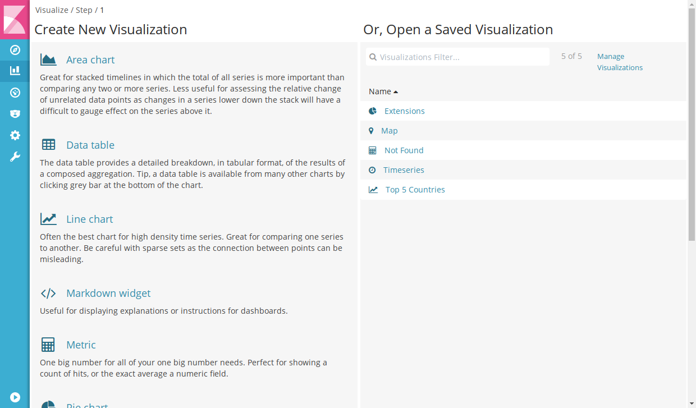

### Pie Chart

Let's start with a simple pie chart. After you selected the type of visualization
you chose whether you want to use the complete data from an index or the data
from a previously saved search. In the example I've just used the complete index.

In the visualization editor that you can see in the screenshot below, you have again the search
bar on top of the screen and the **New**, **Save**, **Load** and **Share** actions and the
time picker.

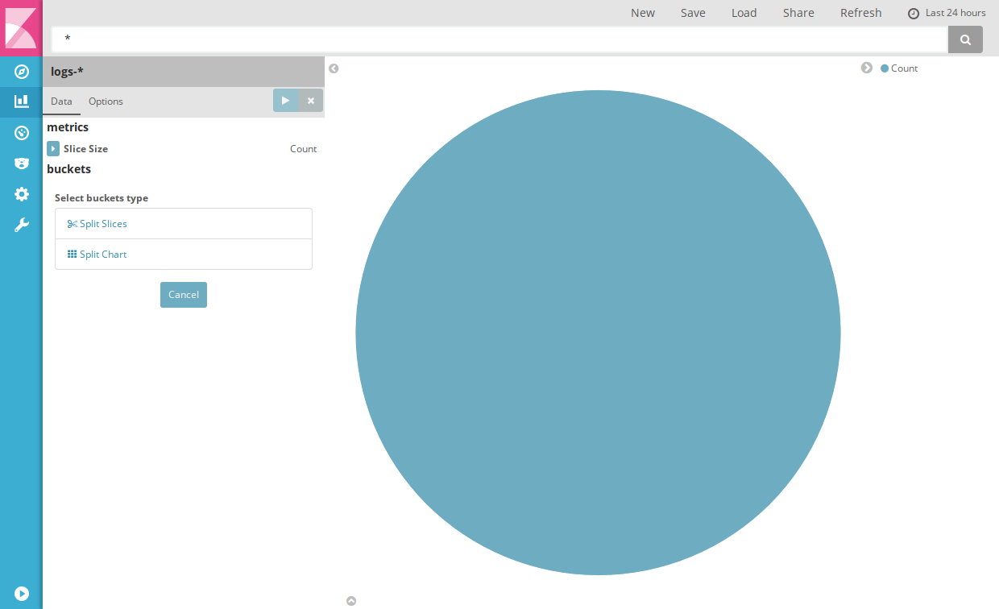

In the main area you will see the visualization output, which currently is just a
circle, because we haven't configured anything yet. In the left panel you will find
the actual editor, in which you can configure your visualization.

If you are completely new to aggregations in Kibana I recommend you to watch
my [tutorial video on aggregations](https://www.youtube.com/watch?v=j-eCKDhj-Os) or read my old
[Kibana 4 tutorial](post:part3-visualize) about visualizations, that goes
a bit more in depth about that topic.

To split up the pie into slices you will need to create a bucket aggregation
of the type **Split Slices**. A bucket aggregation will sort the documents represented
in this graph into multiple so called buckets. You could also describe them as
groups of documents.

You now have to select a type of aggregation, that you want to use to create
the buckets. If we want to visualize what file types were requested to what
percentage, we can use the *Terms* aggregation and select the `extension.raw`
field in my example as the aggregation field.

After making any changes in the editor, you have to click the **Apply changes**
button (*play icon*) on top of the editor, or you could also discard all not yet applied changes
with the button beside it.

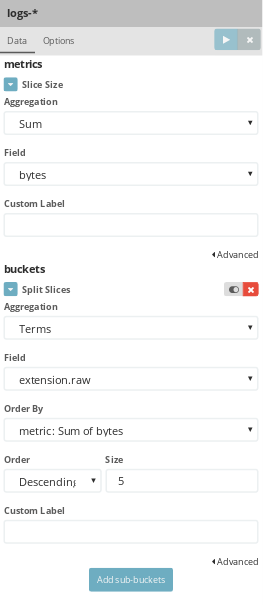

If we apply the changes we now have a pie chart about the top 5 extensions and how
many requests have been made for them. Most aggregations have some options you
can tune in the editor. For example with the terms aggregation we can set a limit on
how many buckets should be created. We could change this to 3, in that case only
the top three extensions will be shown in the pie chart and not the top 5 anymore.

The size of each pie slice is currently determined by the amount of documents
with that value. We can change this in the metrics aggregation section. The metrics
aggregation is responsible for calculating a value for each of the buckets, or slices
in this chart type, which will then determine the size of the slice.

By default the metrics aggregation is set to *Count* and will just count the documents
in each bucket. But we can use this to for example not look at the most requested
file types, but the file types causing the most traffic at our server. Therefore
we use the *Sum* aggregation and select the "bytes"
field, which in our sample data contains the transfered bytes in each request.
If we apply these changes the chart now show the 3 top extensions and the percentage
of bytes they transfered.

In my video about aggregations I linked above, you can find a more detailed explanation of all the
bucket and metrics aggregations and how they work.

Beside configuring which data is used for visualization there is an **Options** tab
to change some other settings of the chart. For a pie chart we can for example
enable the tasty *Donut* option, so it looks like a Donut and not a pie anymore.

If we're happy with the visualization the way it is, we can save it. The same
as for searches applies: if you make any further changes after saving the visualization
you have to save it again to persist these changes.

### Line Chart

Let's have a look at some of the other visualization types. The line chart is another
commonly used chart type.

As you can see in the editor for the line chart there are now other types available
for bucketing in your chart. Obviously on a line chart you won't have the option to
*Split slices* anymore. Let's select the *X-Axis* type for now to create a bucket aggregation
that determines what data will be shown on the x-axis.

To make a chart that shows some data over time we use the *Date Histogram* aggregation
on our `@timestamp` field. Now we have a simple line chart showing basically the
requests over time - since we have the plain count of documents in each bucket
on the y-axis. Beside the field the interval is an important option for the date
histogram aggregation.

It's set to *auto*, meaning Kibana will automatically determine what range your chart
spans in total and what a reasonable size per bucket would be, so that the graph
don't get too many or too less data points on the x-axis. You can change this to
get one x-axis entry per hour or per day, but most of the time *auto* is a good choice.

For the line chart you also have an options tab to change some chart options. For example
you can change the scale of the y-axis from linear to logarithmic, you can smooth
the lines and much more.

Most visualization types support nested aggregations. Let's say we don't want to have
one line for all documents, but we want to get individual lines per country.

We can use the **Add sub-buckets** button to add another type of aggregation. We use the
*split lines* type which will cause each bucket to have its own line. We use a
terms aggregation on the `geo.src` field to get the top 5 countries each with its own
line.

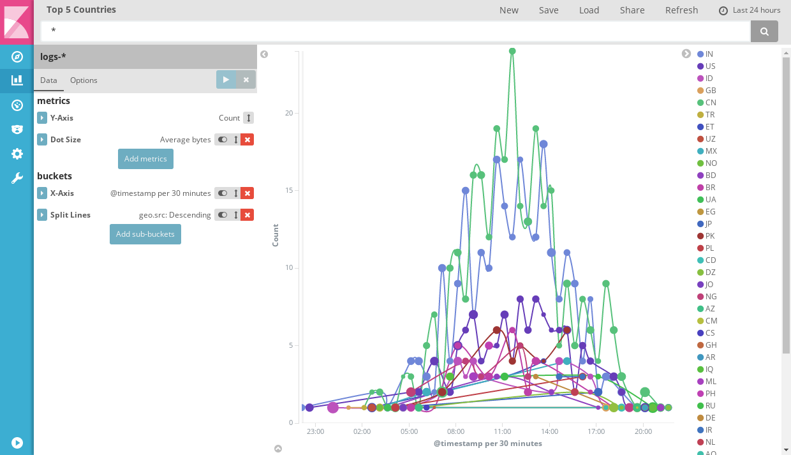

As we can see in the result and in the legend on the right, we get way more than
5 lines. What has happened here?

Kibana applies the aggregations in the order they are specified on the left side.
In our case that means it first creates a bucket for each time slot on the x-axis.
After that it applies the terms aggregation which will now find the top 5 countries
in each time slot. But that way each time slot can have other top 5 countries,
which does lead us to this huge amount of lines.

If we disable the connecting lines in the option, we can see better, that
there are a maximum of 5 points per x-axis slot - maybe even less if there hasn't
been request from 5 different countries during this time slot.

The solution to this problem is changing the order of the aggregations. You can
do this by using the up-down-arrow beside the aggregation and drag-and-drop it
into another order.

If we apply the split lines aggregation first, we see that now we only have 5 lines,
since it first looks up the 5 top countries and than split it up into time slots
on the x-axis.

Some aggregations also support multiple metrics aggregations. For the line chart
we can add another metrics aggregation, that determines the dot size.
If we use an *Average* aggregation over the *bytes* field, we can now also
see the average bytes transfered in each time slot in each country by the dot size.

These nested and multiple aggregations give you great power when visualizing your data.

After we've saved this aggregation, we head back to create a new visualization.

The area chart and the vertical bar chart are pretty similiar to the line chart
in terms of their functionality, so I won't look at them now.

### Data Table

The Data Table shows the result of an aggregation in a tabular format.
That way we could create a simple table, showing a histogram of transfered bytes
in 300 byte steps and how many requests transfered that much bytes.

We just select the *Split Rows* option, select *Histogram* (as Aggregation),
select the *bytes* field and specify an interval of 300, and we will get the following
table.

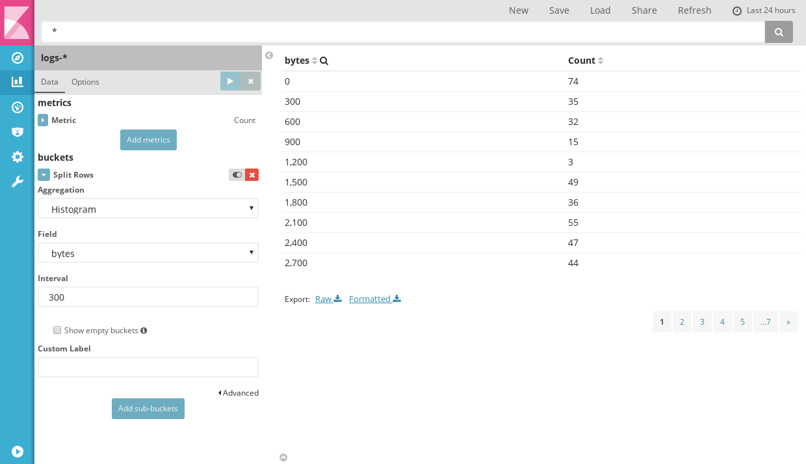

Internally Kibana creates this table for any visualization anyway. Sometimes
it might be useful to inspect that table on a visualization.

To view it find the small upwards pointing caret below any chart and click it.
That way you open the "debug panel" for that visualization. Besides the raw
request and response you can also view the result of that visualization as a data
table on the *Table* tab and even export it to CSV on the bottom.


### Markdown Widget

If you want to write some static introduction or similiar to a dashboard later
you can use the "Markdown widget". It's just a basic textfield, that allows
you to write some markdown, that you can later add to a dashboard.

That way for example you can write introductions or add links to your dashboard.


### Metric

The **Metric** visualization allows you to just output the result of one or multiple
metrics aggregations.

As already mentioned earlier there is a search bar on top of the visualization editor.
We can use this to further narrow down the data that is visualized.

If we search now for `response:404`, our metric will only show the count of all
404 requests instead of all requests in the selected time range.

We can also specify custom labels to each aggregation which will used, depending
on the visualization type, as axis labels or similiar labels.

If we save a visualization with a query entered, that query is stored with the
aggregation which is important once you place it on a dashboard, as we will see later.


### Tile Map

The tile map aggregation is a bit different from the classical charts that we've looked
at so far. It can be used to visualize data containing geo coordinates.

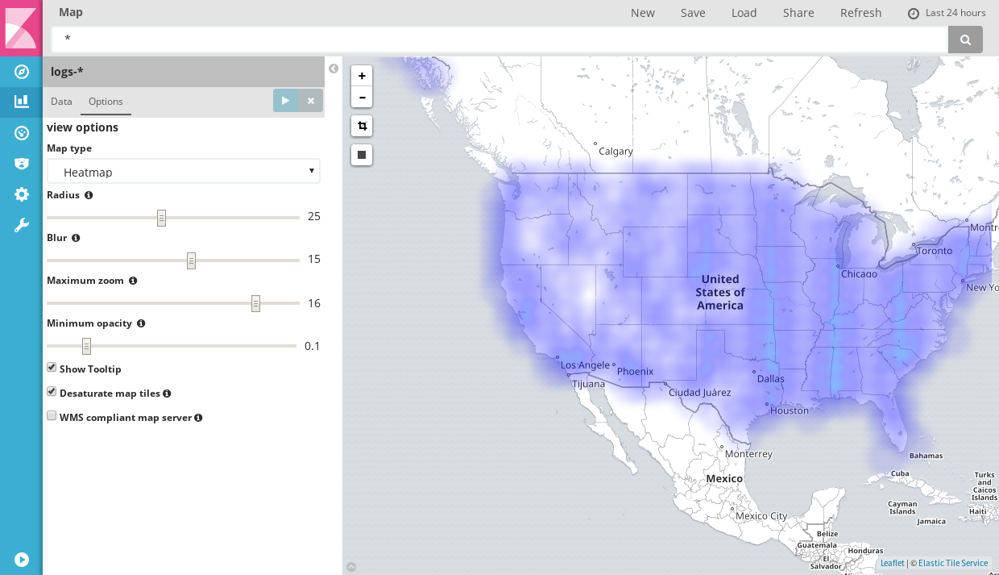

So the only aggregation available is the Geohash aggregation, which will
create buckets for data that is close to each other.

You can the *Fit Data Bounds* icon on the map to zoom the map to only that area
that contains data.

For the most use cases I would recommend to leave the *Change precision on map zoom*
option enabled. That way Kibana will automatically create more granular buckets
when you zoom into the map.

In the options of the map, you can switch the representation from the default
*Scaled Circle Markers* to for example a *Heatmap*.

### Timeseries

The last type of visualizations are "Timeseries". Those are used so that you can
place timelion charts on a dashboard.

Timelion
--------

So let's have a short look at timelion. Since timelion is pretty powerful but also
complex I will only cover the very basics in this introduction and you can find
some more satisfying introductions in [this short introduction](https://www.youtube.com/watch?v=-sgZdW5k7eQ)
or [that detailed](https://www.youtube.com/watch?v=L5LvP_Cj0A0) talk from DevoxxFR.

Since timelion currently has a separated time picker, we need to change to the last
24 hours there again.

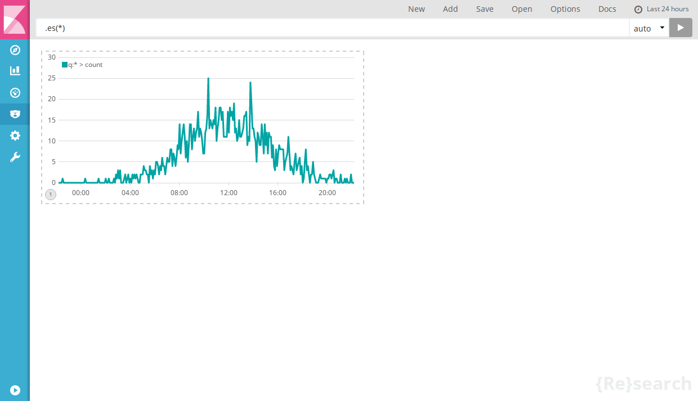

Timelion uses a custom expression language to describe your charts. It is capable of
doing several charting tasks, that you cannot achieve with aggregations easily.
For example I want to see analyze the traffic of my server and see it directly
in comparison to the traffic the day before. This isn't possible with aggregations.

To get data from Elasticsearch the `.es()` function can be used. If we want
to just filter for successfull responses we can use the `q` parameter to the function
to specify a query: `.es(q=response:200)`

With timelion we can easily add multiple data into the same graph, by adding a
second `.es()` function.

As you also see there is a help dialog when typing function names, that shows you
available functions and their parameters.

To get the same data but offseted by one day, we can use the offset parameter and
specify an offset of minus one day (`-1d`). We now have one curve being the current
data and one curve being the data from the day before.

We can use the `.label()` function to give them labels to easily identify them:

```
.es(q=response:200).label('current') .es(q=response:200, offset=-1d).label('previous day')
```

If we want to add them to a dashboard, we can use the save function and select
*Save current expression as Kibana dashboard panel* and specify a name for the panel.
That is the same as if we would have created a new "timeseries" visualization in the
"visualize" tab and entered the expression there. I just find the autocompletion is
working better in the Timelion view, so I would prefer using this instead the "Visualize" view.


Dashboards
----------

Now we've created several visualizations, so we can head to our last part of this
introduction - creating a dashboard.

If you haven't created any dashboard yet, you will start with an empty view.
Use the **Add** button on top to add previously saved visualizations.

Let's add all the visualizations we've created so far. We can also use the *Searches*
tab to add saved searches, which will add the result table to the dashboard.

We can remove any of the visualizations by hovering over it and use the small x in
the top right corner. We can use the move symbol to move it on the dashboard and
the bottom right corner to scale them.

Once we are happy with the layout, we can save the dashboard. You can use the
*Store time with dashboard* option to save the currently selected time range from the
date picker with the dashboard.

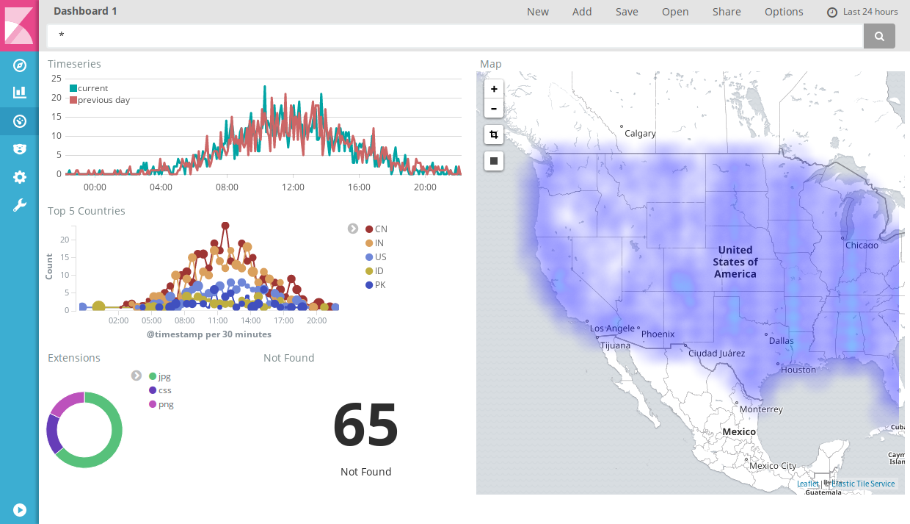

We can also share saved dashboard under the **Share** menu. On the left side you will
find the links to embed via iframe or share the saved dashboard. So this link will always
load the last saved state to the dashboard. On the right side you will find links
to share the current state of the dashboard, whether it's saved or not. This link won't
load any new changes, if you touch and save the dashboard after sharing this link.
Since those links are quite long there is an option to shorten the URL.

The option panel, give you a quick option to switch to a dark theme.

### Searching and Filtering

The dashboard also has a search bar on top of it. As mentioned earlier the searches
made in visualizations are saved with them, meaning the "Not Found" metric
still shows the amount of documents with `reponse:404` even if I don't enter anything in the
dashboard search. If I start searching on the dashboard those search query will be
merged with the query the visualization.

As an example: if we search for `response:200` the "404 Not Found" metric will now show
0, because there are simply no documents where the response is 404 as requested
by the visualization and 200 as requested by the dashboard search at the same time.

The timelion visualization we saved doesn't change at all, since we already had the
`response:200` saved in this graph.

You can also use the graphs directly to filter deeper into your data.
For example clicking on a slice in the donut chart, you create a filter for the
value of this slice. The filters will appear on top of the dashboard.


You have the options to temporarily disable the filter (the first icon with the checkmark),
negate the filter (the magnifier in the middle) or delete them again (the trash bin).

With the *Draw a rectangle* (black square icon) option on tile maps you can filter
your data to a specific rectangle on the map.

Charts with the time on their x-axis can be used to change the time range of your dashboard.
This won't be applied as a filter like the previously shown options, but rather it
will change the time selected in the time picker on top.

If you want to use your dashboard on some screen as kind of monitoring, you can also enable
the *Auto-refresh* in the time picker, to for example let the dashboard automatically refresh
every 10 seconds.


The End
-------

Now you've seen all the basics you need to use Kibana 5 and start vizualizing your own
data. If you have any further questions or requests on specific topics you would like
to see in more detail, please feel free to leave a comment below.

See you the next time and enjoy your Kibana 5.
